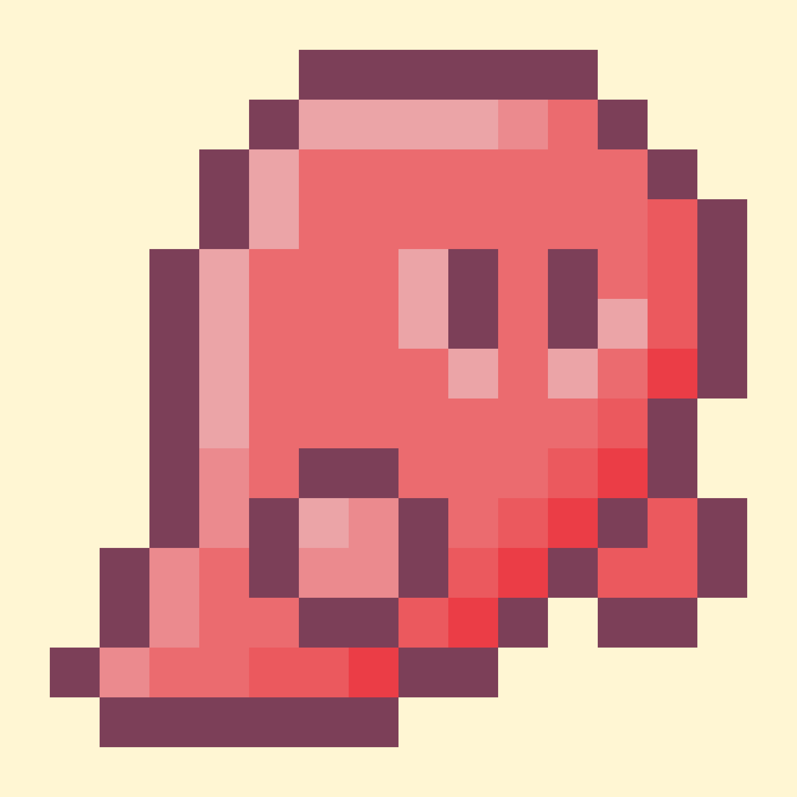

So, in order to get better at making pixel art I started to get into tutorials for learning.

For now, my first learning source was Youtube. I started to watch a lot of pixelart art channels for begginer tips and tricks to start making my first compositions.

One thing I learned is not to start making big pixelarts canvas, instead you can start with a 8x8 canvas. It's more easier to create very little drawings and you have more control about space and colors.

This is my first composition, its like a Mario's Ghost but witk a pink ink. This drawing has very little variations (same color but different shades) to start making shadows and lights.

I think it's pretty good just for my first (real) attemp.

