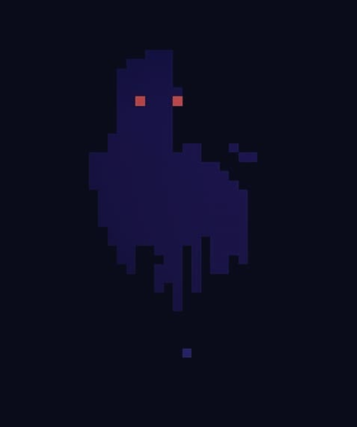

Pixelart is my favorite style for videogames. Why?

When I was a child, I had only three videogame consoles; the ps1, ps2 and the GBA.

I missed a lot of "new" games until I got a PC and I started to play more "new" games.
Even then, the PC was an old mini-laptop with only 2 GB of RAM.

That's the reason I used to play emulators for the SNES, Gameboy and GBA and I fall in
love with the retro style.

As you can see on this website, I like the pixelart style. So, why not start to making it?

I always think I'm not an **artsy boy**. I have zero art skills... I don't like that.

That's why I started with pixelart. The _i love the retro style_ + _i wanna make some art that doesn't suck_

That boring introduction was for this little guy.

My first pixel art ever made.

This was made with [Asperite](https://www.aseprite.org/) and just a little bit of time.

It was made on the fly, and the color palette I chose was random.

I don't remember the canvas size.

Ghost Love makes me happy because it's a reminder that I can make art.
