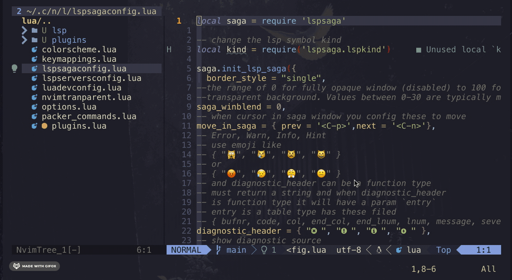
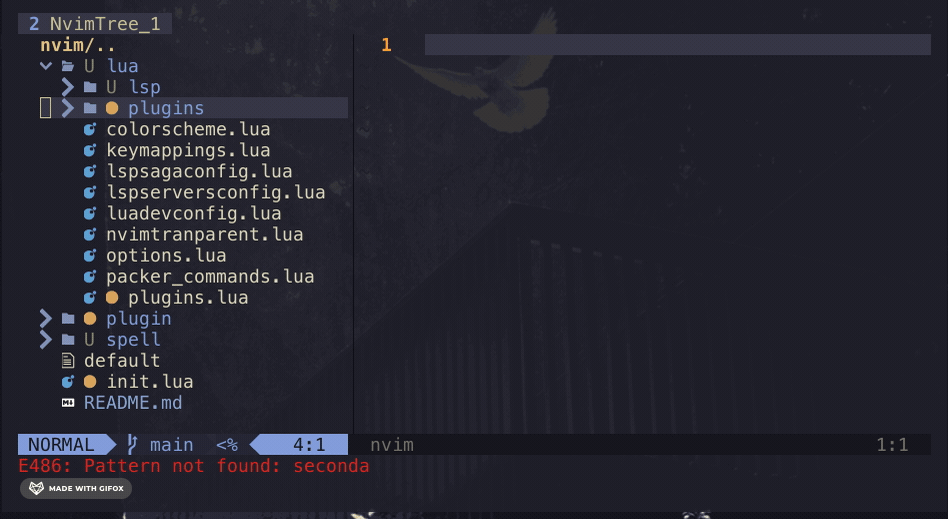
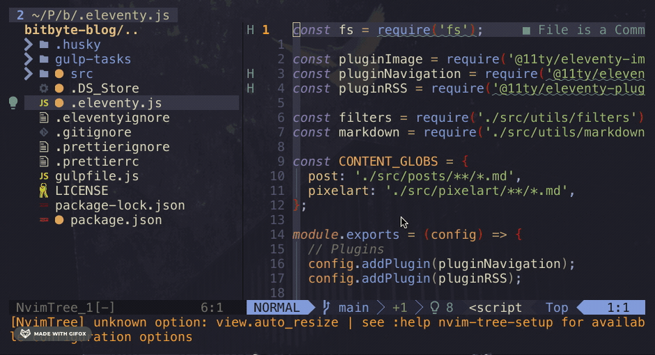

I've been using the vim/nvim ecosystem for more than a year and I just love it.
Using NVIM improved my workflow so much after I learned the basics of it and how to properly create a base configuration.

It's not so much hard to use despite the **insanely amount** of memes on Twitter. Please, stop with the exit vim joke is not funny anymore.
 
I'll write a post about some programming jokes that aged like milk.

## Lua is love ♡

VIM comes with a config file, typically the .vimrc that is written in vimscript.
Even though, is not that bad. I find it difficult to manually configure and the .vimrc file becomes so big if you add a lot of plugins to try.

NVIM uses Lua as an alternative to configuring nvim. It's a very easy programming language, you can learn the basics in a week and start using it with that, you can create a more organized structure to save your plugins and config files.
Another advantage to using Lua is the community around it.

A lot of new plugins for nvim are written on Lua, making it faster than other languages like JavaScript.

Also, making my NVIM config modular helps **a lot** with the organization of everything.

Next, I'm gonna tell you what plugins I use the most.

## Most Have Plugins

This plugins are a must if you wanna improve you NVIM experience.

### Telescope

This is one of the plugins I use the most, one of the best fuzzy finders around here.

I like how fast it is and a lot of the options that you can configure with it. Search by file or by a regex expression with a nice UI and a lot of color-schemes are supported.

Try it: [Telescope plugin](https://github.com/nvim-telescope/telescope.nvim)

### nvim-tree

I see it as the [NERDTree](https://github.com/preservim/nerdtree) improved, very light and blazingly fast.
You can use web-dev-icons. Extremely configurable but no overwhelming.

It's easy to learn all the keybindings, wanna add a new file? Just type a, edit? e, open? o. So simple and intuitive

Try it: [nvim-tree plugin](https://github.com/kyazdani42/nvim-tree.lua)

### nvim-tree-sitter

Tree sitter it's a parser generator for our code in order to nvim can understand our code.
This is very helpful because you can have a lot of cool features for your favorite programming language, like: syntax highlight, folding, text-object manipulation, etc.

The list of supported languages is huge and a lot of new features are being added to nvim.

Try it: [nvim-tree-sitter plugin](https://github.com/nvim-treesitter/nvim-treesitter)

### Float Term

This is one has increased my productivity a lot. Instead of open a new terminal somewhere else of changing between spaces
I just open a new float term. Float term is just a terminal but... floating in your nvim space.

You can have a lot of float terms opened but one is just enough for me. The easy access is hot.

Try it: [Float Term plugin](https://github.com/voldikss/vim-floaterm)

## More plugins

Those are my most "showy" plugins. I use a lot more but are just for tiny things like color colorizer, lsp config, color-schemes, etc.
I strongly suggest that you vim config should be minimal as you can to get a faster start and use Lua instead of vimrc. This will make your
life easier and happier.

If you wanna see all my nvim config you can check my repo
[nvim configuration](https://github.com/hectoraldairah/nvim-config)

It's not that fancy so maybe you can understand everything there.

Well, that it! I know for sure that this plugins list will be changing over time but I will stay with the philosphy of less is more
